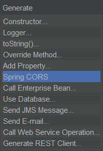
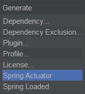

# Spring Boot Tools 4 NetBeans

File templates for Spring Boot, as well as code generators for Java and Maven
are provided.

In the New File dialog, quickly create new entities, command line runners,
 and Spring Data repositories:

In Java source files, quickly generate Spring CORS support:

In Maven POM files, quickly generate support for Spring Actuator and Spring Loaded:

